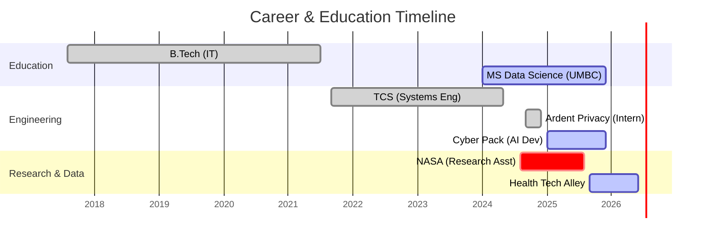

  

  

  <h3> 🚀 Turning Data into Decisions & Code into Solutions </h3>
  

    I am a <b>Data Scientist</b> and <b>Full Stack Engineer</b> bridging the gap between research and production. 
    Currently analyzing large-scale datasets at <b>Health Tech Alley</b> and building AI web apps at <b>Cyber Pack Ventures</b>.
  

---

### 🗺️ My Journey (Visualized)

---

### 🛠️ The Tech Stack

  
   
  
   
  

---

### 📊 Github Stats

  
  
  

  

---

### 🏆 Key Projects

| **Project** | **Stack** | **Impact** |
|:---:|:---:|:---|
| **Land Cover Simulation** | `Python` `PyTorch` `U-Net` | **NASA Research:** Simulated land cover changes using Diffusion Models with **85% accuracy** to aid environmental policy. |
| **Aletheia Web App** | `Next.js` `FastAPI` `Gemini` | **Full Stack:** Built an LLM-driven user study platform handling **1,000+ interactions** with 100% behavior consistency. |
| **Weather Forecasting** | `xarray` `NetCDF` `DDPM` | **Data Eng:** Engineered high-performance pipelines for processing 2-m temperature anomalies. |

---

  
  
  

